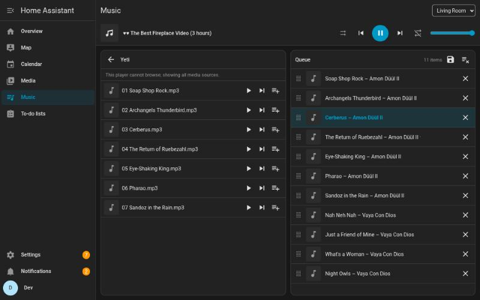
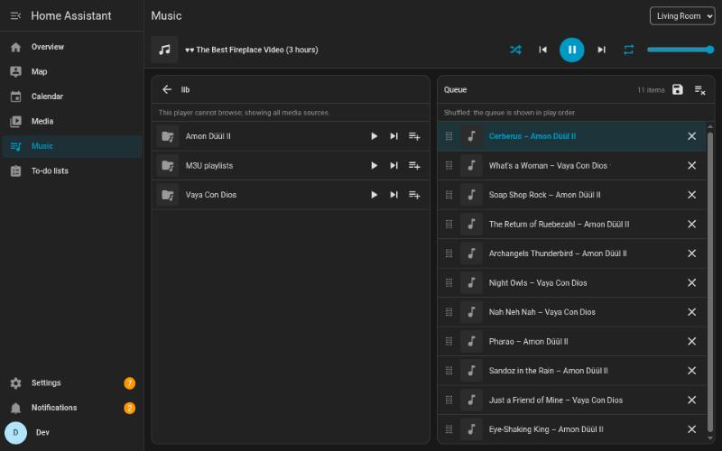
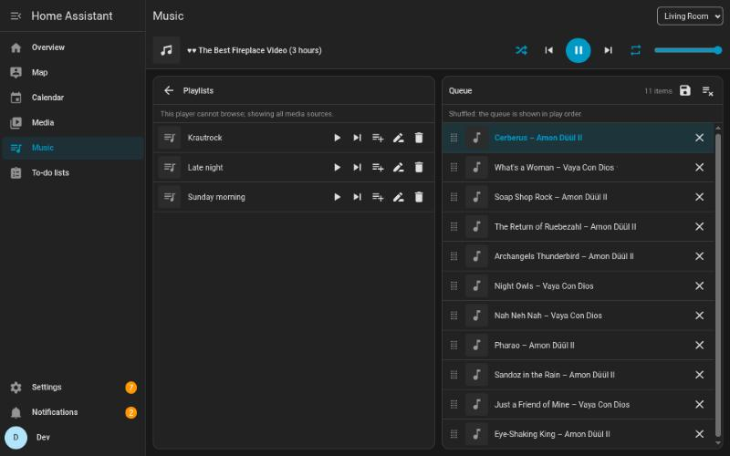
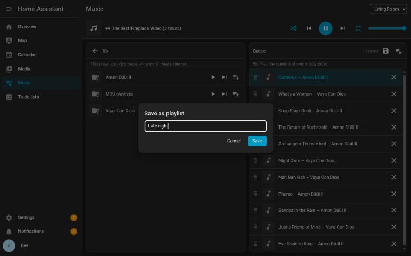
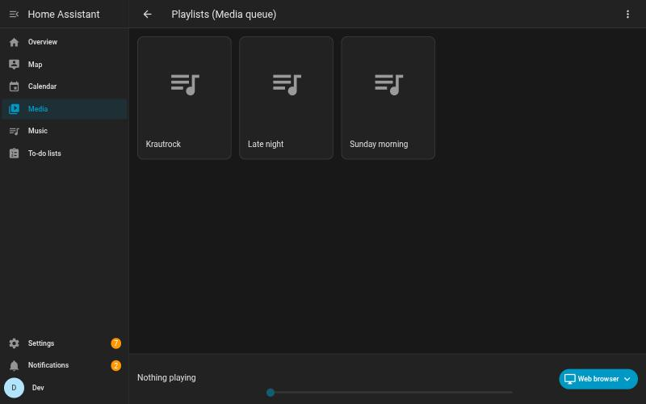
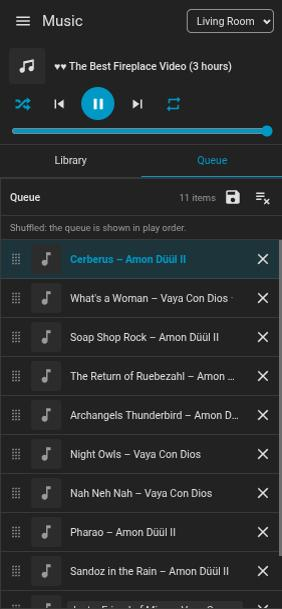
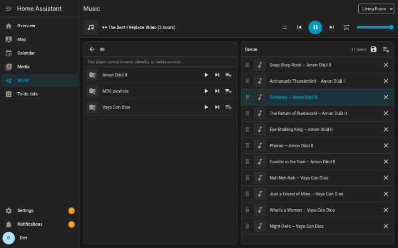
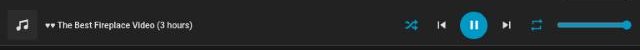

# Media queue for Home Assistant

[](https://hacs.xyz/docs/faq/custom_repositories)
[](https://github.com/switch87/ha-media-queue/actions/workflows/validate.yml)
[](https://github.com/switch87/ha-media-queue/actions/workflows/ci.yml)

A play queue for **every `media_player`**, kept by Home Assistant itself, and a
**Music** page in the sidebar to use it: browse everything Home Assistant's
media browser offers, put tracks, albums, folders and playlists in a visible
queue, and let Home Assistant play them one after the other on the speaker of
your choice.



## Why

Home Assistant can browse your music (local files, a NAS, DLNA servers, radio,
the players' own libraries) and play **one** item on a player. What it does
not have is a queue: "play this album", "play this next", "add that folder",
see what comes next, skip, reorder. Some players have a queue of their own,
many don't, and each works differently.

Media queue adds that queue in Home Assistant, **per player, independent of
what the player itself supports**. Your players stay the normal entities they
are; the queue plays each item with the standard `media_player.play_media`
and moves on when an item ends.

## Features

- **Library** with every source of Home Assistant's media browser for the
  chosen player. Every audio item has **▶ Play** (replace the queue and play),
  **⏭ Play next** (right after the current item) and **➕ Add** (to the end) —
  also folders, albums and artists (expanded into their tracks) and `.m3u`,
  `.m3u8` and `.pls` playlists of your local media.
- A **visible queue**: the current item is highlighted; click an item to jump
  to it, ✕ to remove it, drag the handle to move it, clear it with one button.
- **Shuffle** and **repeat** (off / whole queue / current item) per player.
- **Real titles**: tracks from your local media show "title – artist" from the
  files' tags (ID3, Vorbis comments, MP4, …) instead of the file name.
- **Saved playlists**: save a queue as a named playlist in one library shared
  by all players, load it into any player's queue with Play, Play next or Add,
  rename and delete them.
- The saved playlists also appear in **Home Assistant's own media browser**
  (Media → *Playlists (Media queue)*).
- **Actions** for automations and scripts, and a websocket API.
- English and Dutch; works on a phone (library and queue become tabs).
- Light: no indexing, no polling, folders are read only when you open them.

| Shuffle and repeat | Saved playlists |
|---|---|
|  |  |

| Save a queue as a playlist | Playlists in HA's media browser | On a phone |
|---|---|---|
|  |  |  |

## Requirements

- Home Assistant **2026.9** or newer (developed and tested on 2026.9.4).
- No extra Python packages: tags are read with `mutagen`, which is a
  dependency of Home Assistant itself.
- Any `media_player` that supports *play media*. To advance on its own, the
  player must report when an item ends (see [How playing works](#how-playing-works)).

## Installation

### HACS (custom repository)

1. HACS → ⋮ → *Custom repositories* → add
   `https://github.com/switch87/ha-media-queue` with category *Integration*.
2. Install **Media queue** and restart Home Assistant.
3. Continue with [Configuration](#configuration).

### Manual

1. Copy `custom_components/media_queue` from the latest release into
   `<config>/custom_components/`.
2. Restart Home Assistant.

## Configuration

*Settings → Devices & services → Add integration → Media queue.* There is
nothing to fill in; the integration can be added once. The sidebar gets a
**Music** entry (*Muziek* on Dutch installations) for every user.

## Usage

1. Open **Music** and pick a player at the top right.
2. Browse the library on the left. On any track, album, artist or folder:
   - **▶ Play** replaces the queue with it and starts playing,
   - **⏭ Play next** puts it right after the current item,
   - **➕ Add** appends it.
3. The queue on the right shows what plays and what comes next. Click an item
   to play it, ✕ removes it, drag the ⠿ handle to move it.
4. The transport bar has 🔀 shuffle, previous, play/pause, next, 🔁 repeat and
   the player's volume. Previous and next go through the queue; pause and
   volume go to the player itself.



### Shuffle and repeat



- The queue list always shows the **real play order**. Turning shuffle on
  keeps the current item playing (it moves to the top) and shuffles all other
  items after it; a note says "Shuffled: the queue is shown in play order."
  Turning shuffle off restores the order in which the items were added; the
  current item stays current.
- While shuffled, *Add* mixes the new items into the part after the current
  item, *Play next* puts them (shuffled) right after it.
- **Repeat whole queue**: after the last item the queue starts again at the
  top (shuffled anew when shuffle is on, never starting with the item that
  just played). **Repeat current item**: the item plays again when it ends;
  next and previous still move.
- Both settings are per player and survive a restart. They are the queue's
  own: the player's shuffle/repeat modes are never changed.

### Saved playlists

- **Save**: the 💾 button above the queue saves the player's queue, in the
  order shown, under a name (1–100 characters, unique regardless of case). An
  existing name asks before it is overwritten.
- **Load**: the **Playlists** folder at the top of the library (for every
  player) lists the saved playlists with ▶ ⏭ ➕, rename and delete. Open one to
  see its tracks, each with ▶ ⏭ ➕ of its own.
- Playlists keep what the queue knew: source, title, artist, album, duration,
  picture — from any source (local files, DLNA, radio streams, …).
- In Home Assistant's own media browser the playlists are under
  *Playlists (Media queue)*. There a playlist opens to its tracks and each
  track plays on its own (HA's browser plays one item at a time); a whole
  playlist is loaded from the Music page or with `media_queue.load_playlist`.
- Limits: 1000 items per playlist, 500 playlists.

## Actions

All actions are in the `media_queue` domain. Players are named by
`entity_id`; queue items by `item_id` (from `get_queue`) or by position
(`index`, 0 is the first).

| Action | Fields | Does |
|---|---|---|
| `add` | `entity_id`, `media_content_id`, `media_content_type`, `mode` (`replace` / `add` / `next` / `play`), `title` | Adds a track, album, folder, artist or playlist file; `replace` and `play` start playing. Returns how many items were added. |
| `play_index` | `entity_id`, `item_id` or `index` | Plays that item. |
| `next`, `previous` | `entity_id` | Plays the next / previous item. |
| `remove` | `entity_id`, `item_id` or `index` | Removes an item. |
| `move` | `entity_id`, `item_id` or `from_index`, `to_index` | Moves an item. |
| `clear` | `entity_id` | Empties the queue (what plays keeps playing). |
| `set_shuffle` | `entity_id`, `shuffle` (true/false) | Shuffle on or off. |
| `set_repeat` | `entity_id`, `repeat` (`off` / `all` / `one`) | Repeat mode. |
| `get_queue` | `entity_id` | Returns the queue (response only). |
| `save_playlist` | `entity_id`, `name`, `overwrite` | Saves the player's queue as a playlist. |
| `load_playlist` | `entity_id`, `name`, `mode` | Puts a saved playlist in the player's queue. |
| `rename_playlist` | `name`, `new_name` | Renames a playlist. |
| `delete_playlist` | `name` | Deletes a playlist. |
| `get_playlists` | — | Returns all playlists: id, name, count, duration (response only). |

Playlist names in actions are matched regardless of case.

### Examples

Wake up with an album, shuffled:

```yaml
automation:
  - alias: Morning music
    triggers:
      - trigger: time
        at: "07:30:00"
    actions:
      - action: media_queue.set_shuffle
        data:
          entity_id: media_player.kitchen
          shuffle: true
      - action: media_queue.add
        data:
          entity_id: media_player.kitchen
          media_content_id: "media-source://media_source/local/Music/Some Artist/Some Album"
          media_content_type: music
          mode: replace
```

Load a saved playlist and repeat it all evening:

```yaml
script:
  evening_playlist:
    sequence:
      - action: media_queue.load_playlist
        data:
          entity_id: media_player.living_room
          name: Late night
          mode: replace
      - action: media_queue.set_repeat
        data:
          entity_id: media_player.living_room
          repeat: all
```

Read the queue in a template-friendly way:

```yaml
- action: media_queue.get_queue
  data:
    entity_id: media_player.living_room
  response_variable: queue
- action: persistent_notification.create
  data:
    message: "{{ queue['items'] | length }} items, playing {{ queue.current }}"
```

`media_content_id` values are the ids of Home Assistant's media browser; the
easiest way to find one is to add the item from the Music page once and look
at `get_queue`.

## Websocket API

Used by the Music page; available to other frontends. All commands are
`media_queue/…`:

- Queue: `get`, `subscribe`, `add`, `play_index`, `next`, `previous`,
  `remove`, `move`, `clear`, `set_shuffle`, `set_repeat` (all with
  `entity_id`; items by `item_id`, the index is a fallback).
- Playlists: `playlists/list`, `playlists/get` (`playlist_id`),
  `playlists/save` (`entity_id`, `name`, `overwrite`), `playlists/rename`
  (`playlist_id`, `name`), `playlists/delete` (`playlist_id`),
  `playlists/load` (`entity_id`, `playlist_id`, `mode`, optional `item_id` for
  one track).

A queue snapshot holds `items` (in play order, each with `id`, `title`,
`artist`, `album`, `duration`, `thumbnail` when known), `current`, `next`
(what the next button plays), `shuffle`, `repeat`, `phase` and `last_error`.
`subscribe` sends a full snapshot when the items or settings change, a small
`{"playback": true, …}` update when only the position changes, and
`{"closed": true}` when the integration unloads.

**Permissions**: reading a queue needs read access to the player; changing it
needs control. Listing playlists is open to every user; saving and loading
need control of the player; renaming and deleting need an administrator or a
user who may control at least one media player.

## How playing works

Each queue item is played with a plain `media_player.play_media` on the real
player. Items from media sources (`media-source://…`) are resolved first and
sent as a URL of your Home Assistant; items from a player's own library are
sent as they are.

The queue moves on when the current item **ends by itself**: the player
leaves `playing` for `idle`/`off`/`on`/`standby` (or pauses) within 5 seconds
of the item's duration. The duration comes from the player or, for local
files, from the tags.

Not an end, on purpose:

- **A stop or pause before the end** (someone pressed stop elsewhere): the
  queue waits; pressing play on the player continues.
- **Items without a duration** — radio and other streams never end by
  themselves, so a stop of the radio never starts something else. Press next
  to go on.
- **The player plays something else** (another app or card started other
  media): the queue stops following until you play from it again.

Items that fail to play are skipped (at most 3 in a row), as are items the
player accepts but does not start within about 25 seconds (an unreachable
URL, an unsupported format). The Music page shows these errors.

### Player notes

- **MPD** (core `mpd` integration): every `play_media` clears MPD's own
  playlist and plays the one item, so MPD's playlist only ever holds the
  current item — the queue lives in Home Assistant. **Turn MPD's own repeat
  mode off** (`mpc repeat off`): with repeat on, MPD replays the single item
  forever and the queue never moves on. Use the queue's shuffle and repeat
  instead.
- **Sonos**: local files are played through a URL of your Home Assistant, so
  the speaker must be able to reach Home Assistant's **internal URL**
  (*Settings → System → Network*). Items from Sonos favorites or the Sonos
  library replace Sonos's own queue each time (the page shows a note there);
  the queue still steps through them one by one.
- **Next/previous on the player's own controls** (a standard media card, the
  player's app) act on the player's own queue, which holds only the current
  item. Use the Music page or the `media_queue.next` / `media_queue.previous`
  actions.

## Performance

Made to run on a Raspberry Pi with little memory:

- No index and no polling: folders are read only when you open or add them;
  the queue follows the player through its state changes.
- Adding a large folder is bounded: at most 1000 items per queue, 8 folder
  levels and 200 folder reads per add.
- Tags are read **after** an add, in the background and in small batches
  (at most 100 files or 2 seconds per batch, one queue update per batch), so
  adding is as fast as without tags. **Embedded cover art is never read**:
  for FLAC only the stream info and the comments are read; for MP3 files with
  a large tag only the title, artist and album frames; anything else reads at
  most 256 kB per file. A batch that hangs for 30 seconds (a stuck network
  share) stops tag reading for that player for 10 minutes.
- The queues are written to disk a few seconds after a change; playback-only
  changes much later, to spare SD cards.

## Troubleshooting

- **The queue does not go to the next item**: does the player report a
  duration (Developer tools → States → `media_duration`)? Streams never
  advance. For MPD, turn MPD's repeat off. If the player stays `playing` after
  the end of an item (some players loop), the queue cannot see the end.
- **Sonos does not play local files**: check that Home Assistant's internal
  URL is reachable from the speaker (not `localhost`, no HTTPS certificate the
  speaker refuses).
- **File names instead of titles**: only local media files are read; other
  sources keep their browse titles. Items that were in a queue before
  version 0.2.0 keep their file names until added again. Files with tags
  larger than 256 kB in formats other than FLAC and MP3 (an M4A with a big
  cover) keep their file name.
- **The Music page does not appear**: reload the browser after the restart;
  check that the integration is added under *Devices & services*.
- **Diagnostics**: *Devices & services → Media queue → ⋮ → Download
  diagnostics* (queue sizes, positions, settings and playlist counts; no
  names, the player's media URL is redacted).

## FAQ

**Does this replace the players' own queues?** No. Players keep working as
before; the queue in Home Assistant is used when you play from the Music page
or the actions.

**Can I use it without the Music page?** Yes — the actions work on their own,
for example from automations or voice scripts.

**Video?** The queue is made for audio. Videos inside folders are only queued
for players that are TVs; images are skipped.

**Where is my data?** In `.storage/media_queue` (queues) and
`.storage/media_queue.playlists` (playlists) in your configuration folder.

## Uninstall

*Settings → Devices & services → Media queue → Delete.* This also deletes the
stored queues **and the saved playlists**. Then remove the integration in HACS
(or delete `custom_components/media_queue`) and restart.

## Contributing

Bug reports and pull requests are welcome at
<https://github.com/switch87/ha-media-queue/issues>. See
[CONTRIBUTING.md](CONTRIBUTING.md) for the development setup and the checks
every change has to pass.

## Changelog

See [CHANGELOG.md](CHANGELOG.md).

## License

[MIT](LICENSE) © 2026 Gert Pellin
